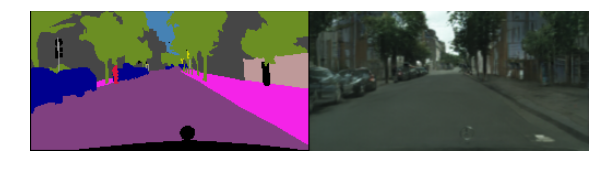
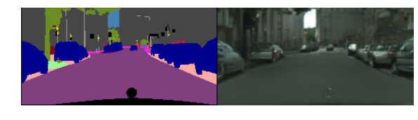
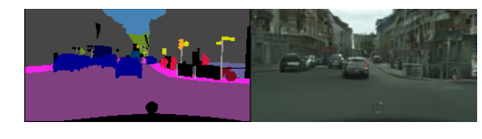

# Image-to-Image Translation (Chainer)
Chainer implementation for [Image-to-Image Translation Using Conditional Adversarial Networks](https://phillipi.github.io/pix2pix/), it's transplanted from [pix2pix](https://github.com/phillipi/pix2pix).
## Result






## Step by Step
### Download Datasets --- Cityscapes
Sign up, Log in & Download **gtFine_trainvaltest.zip** & **leftImg8bit_trainvaltest.zip** from [cityscapes](https://www.cityscapes-dataset.com)
### Split Dataset into train, val & test set
```bash
    python split_data_sets.py --root [Image Folder] --list [List Folder]  
```
**Note**: Run `python split_data_sets.py -h` for more details.
### Combine A & B into a single image
```bash
    python combine_A_and_B.py --list [List Path] --save_dir [Save Folder]
```
### Generate list file for train, val & test dataset
```bash
	ls train > train.txt
	ls val > val.txt
	ls test > test.txt
```
**Note**: Run commands above in folder containing train, val & test subfolder
### Train
```bash
	python train.py
```
**Note**: Run `python train.py -h` for more options.
### Test
```bash
	python test.py
```
**Note**: Run `python test.py -h` for more options.

## Network Architecture
### Generator
**U-net**

### Discriminator
**PatchGAN**, **FOV** is determined by **n_layers**.

## Acknowledgments
Code borrows heavily from [Chainer: DCGAN](https://github.com/pfnet/chainer/tree/master/examples/dcgan).
